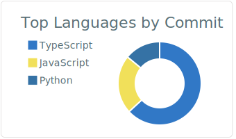

# aoi | Software Engineer

## MY SKILLS
### BUSINESS  

          
          
### HOBBY  

### LEARNING  

          
## TECHNOLOGICAL ANTENNA
  - Software Architecture
  - Code Quality Analytics
  - Functional Programming

    <h2> And more... </h2>

    
    

